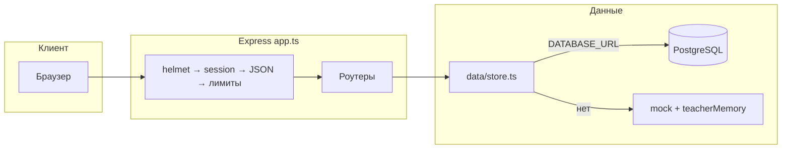
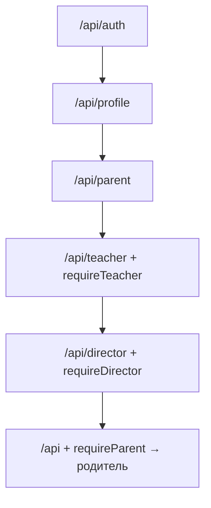
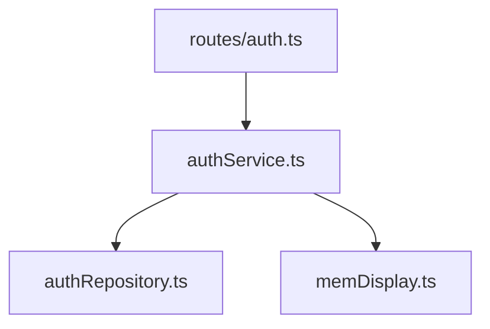

# Архитектура сервера (блок-схемы)

**Удобнее смотреть в браузере:** откройте файл [`architektura-servera.html`](./architektura-servera.html) — там те же схемы с подписями.

Ниже — Mermaid для предпросмотра в редакторе (если включена поддержка).

## Рис. 1. Общий путь запроса

**Подпись:** запрос сначала проходит middleware в `app.ts`, затем роут; родительские данные идут через `store.ts` → БД или память.

## Рис. 2. Порядок монтирования `/api`

**Подпись:** общий родительский `apiRouter` — последним, чтобы не перехватывать чужие префиксы.

## Рис. 3. Вход: слои

**Подпись:** `users` и email — `authRepository`; без БД — `memDisplay`.

## Рис. 4–7

См. полную версию в **`architektura-servera.html`** (учитель БД/RAM, слой репозиториев, `server.ts` + статика).
